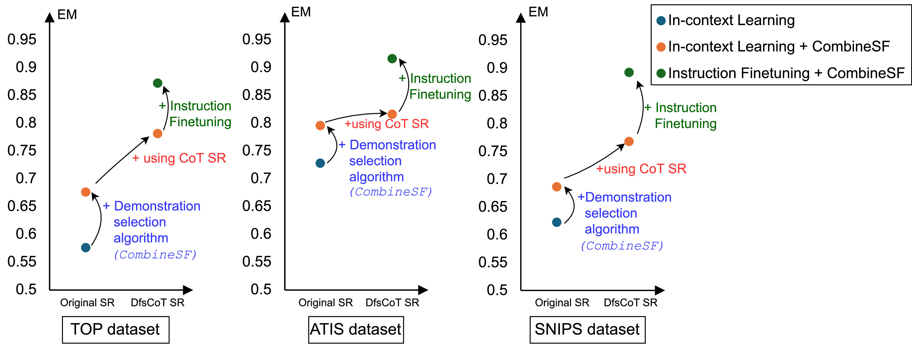

## Improving hierarchical semantic parsing with LLMs: Demonstration selection and chain-of-thought prompting via semantic fragment decoding

Recently, pre-trained Large Language Models (LLMs) have shown remarkable effectiveness in various Natural
Language Processing (NLP) tasks. In hierarchical semantic parsing, previous methods typically process the entire
semantic representation, which hinders language models from generalizing sub-semantic fragments (semantic
units). In our approach, the original semantic representation of a sentence is divided into a list of semantic fragments. These fragments are used for demonstration selection, enabling the model to generalize sub-semantic
fragments and incrementally decode these semantic units. Our contributions are threefold: (1) proposing a
novel method for demonstration selection that maximally covers the semantic fragments present in a query
sentence, (2) introducing a chain-of-thought (CoT) semantic representation based on logical decomposition,
and (3) incorporating instruction fine-tuning for LLMs in this task. Experimental results demonstrate that our
proposed method significantly improves the baseline system in both in-context learning and instruction finetuning settings for LLMs. In the in-context learning setting, our demonstration selection method outperforms
the baseline approach, with improvements ranging from 6 % to 10 % in Exact Match scores on three wellknown benchmark datasets: TOP, ATIS, and SNIPS. Additionally, performance is further enhanced when the CoT
prompting technique is incorporated, achieving competitive state-of-the-art results across all datasets, including
TOP, ATIS, SNIPS, and a large-scale dataset, TOPv2, using the instruction fine-tuning technique. Furthermore,
our approach is highly applicable to various structural parsing tasks in NLP. The source code is available at
https://github.com/phuongnm94/hsp_sem_fragment_dec.

Full paper here: [https://doi.org/10.1016/j.knosys.2025.114256](https://doi.org/10.1016/j.knosys.2025.114256)

## Results  
 
 

##  Data   
- SNIPS 
> **Note:** other dataset can follow SNIPS for reproduce results.

##  Python ENV 
Init python environment 
```cmd
    conda create --prefix=./env_spllm  python=3.9
    conda activate ./env_spllm 
    pip install -r requirements.txt
```

## Run 
1. Init environment follow the above step.
2.  Run
    ```
    bash  scripts/run_all_steps.sh
    ```
    
## Citation 
   
```bibtex@article{MINHNGUYEN2025114256,
title = {Improving hierarchical semantic parsing with LLMs: Demonstration selection and chain-of-thought prompting via semantic fragment decoding},
journal = {Knowledge-Based Systems},
volume = {328},
pages = {114256},
year = {2025},
issn = {0950-7051},
doi = {https://doi.org/10.1016/j.knosys.2025.114256},
url = {https://www.sciencedirect.com/science/article/pii/S0950705125012973},
author = {Phuong {Minh Nguyen} and Truong Dinh Do and Minh {Le Nguyen}}
}

```

